# Daliz

Multi-tenant business management platform. **One tenant = one isolated PostgreSQL database.**

```
                    ┌──────────────────────────┐
                    │   daliz_platform (DB)    │  identities, orgs, tenants, provisioning,
                    │                          │  platform RBAC, sessions, platform audit
                    └────────────┬─────────────┘
             ┌───────────────────┼───────────────────┐
             ▼                   ▼                   ▼
   daliz_tenant_acme    daliz_tenant_globex    daliz_tenant_…     users, roles, permissions,
   (own role, own DB)   (own role, own DB)     (own role, own DB) settings, branding, audit, …
```

## Demo

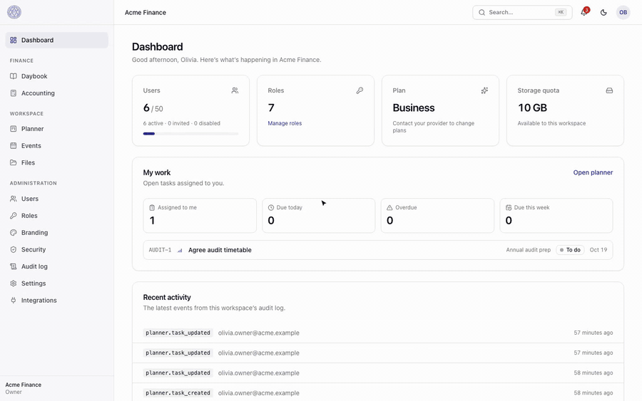

▶️ **[Watch the narrated version (MP4, 1:21, with sound)](docs/demo/daliz-demo.mp4)**: a walkthrough of the dashboard, accounting and reports, daybook, planner, events, files, branding, dark mode and the Super Admin console.

<table>
  <tr>
    <td>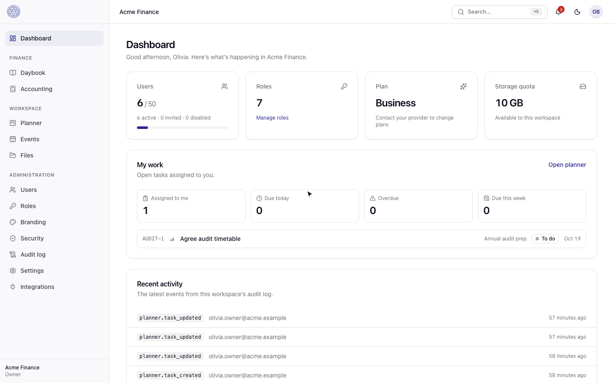<br /><sub>Dashboard</sub></td>
    <td>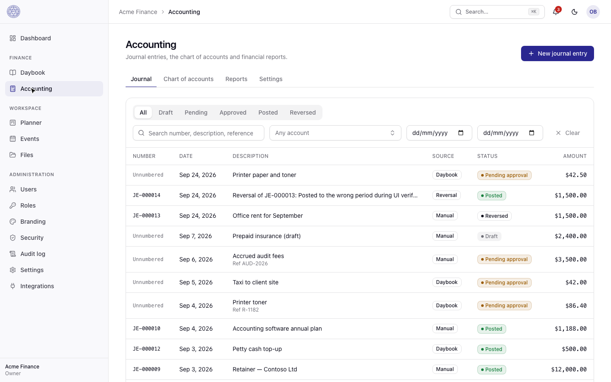<br /><sub>Accounting: journal with approval workflow</sub></td>
  </tr>
  <tr>
    <td>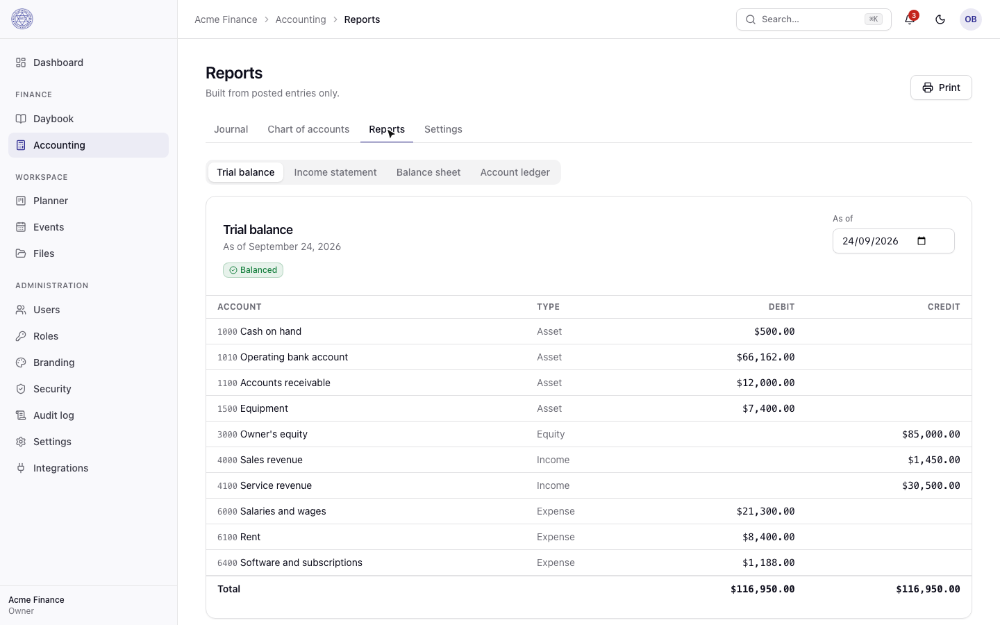<br /><sub>Reports: trial balance from posted entries</sub></td>
    <td>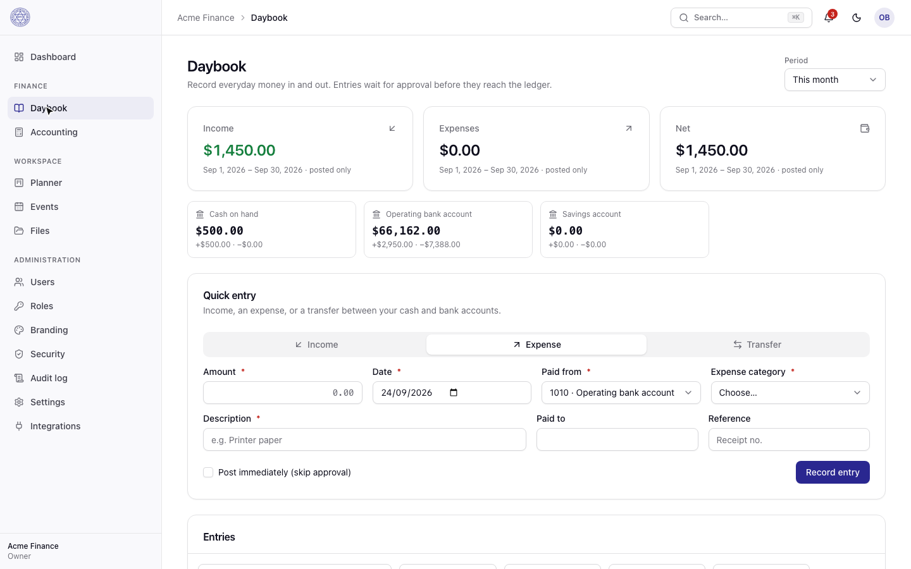<br /><sub>Daybook: everyday income and expenses</sub></td>
  </tr>
  <tr>
    <td>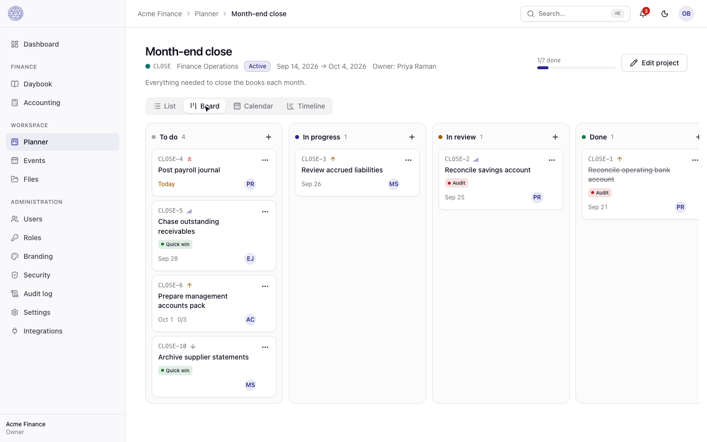<br /><sub>Planner: project board</sub></td>
    <td>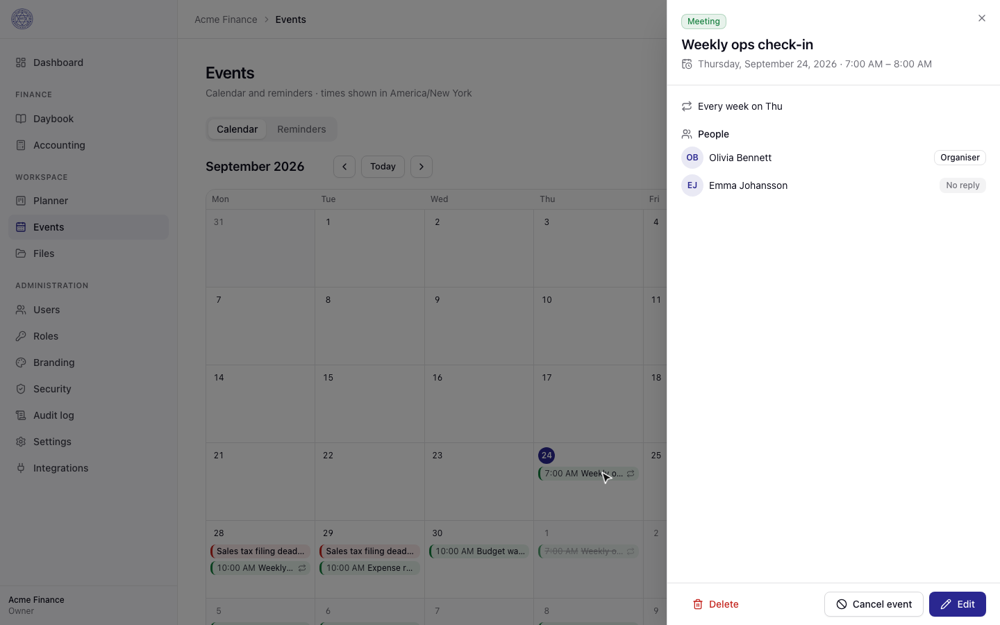<br /><sub>Events: recurring series, attendees and RSVPs</sub></td>
  </tr>
  <tr>
    <td>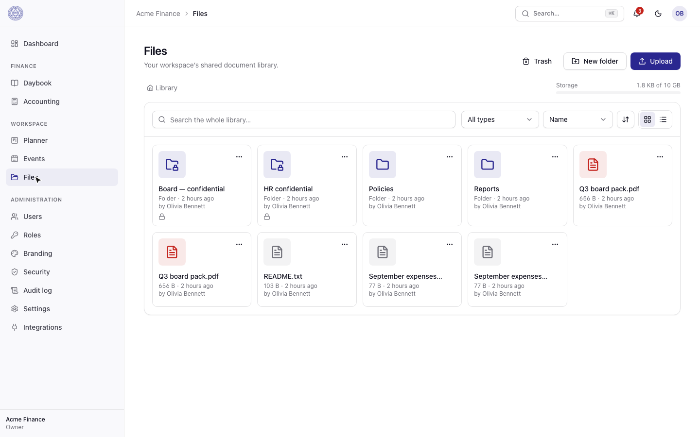<br /><sub>Files: library with restricted folders</sub></td>
    <td>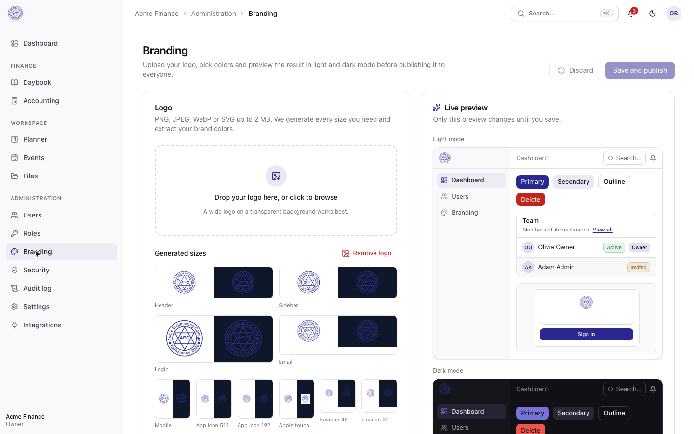<br /><sub>Branding: logo variants and WCAG-checked theme</sub></td>
  </tr>
  <tr>
    <td>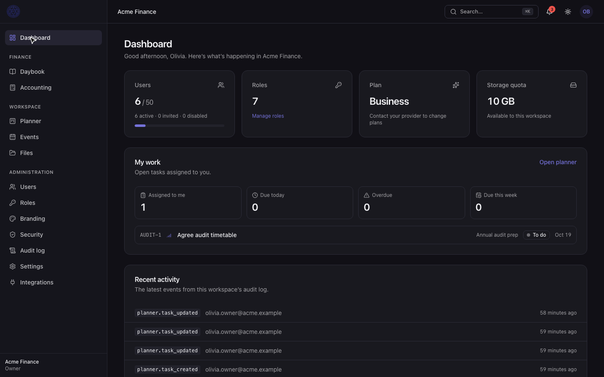<br /><sub>Dark mode</sub></td>
    <td>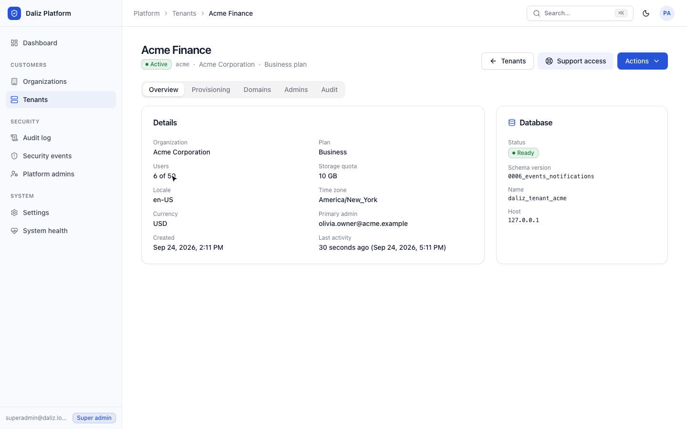<br /><sub>Super Admin: tenant and database status</sub></td>
  </tr>
</table>

<sub>Recorded against the local seed data (<code>pnpm db:seed</code>) with Playwright; narration generated with <a href="https://huggingface.co/hexgrad/Kokoro-82M">Kokoro-82M</a> (voice <code>af_heart</code>), mixed with ffmpeg.</sub>

## What's here today

| Area | Status |
| --- | --- |
| Monorepo, local infra (Postgres, Redis, MinIO, Mailpit, optional ClamAV via podman/docker compose) | ✅ |
| Platform database + one database per tenant, connection manager, migrations fanned out to every tenant | ✅ |
| Tenant provisioning (idempotent, resumable, audited) and gated, cancellable decommissioning | ✅ |
| Authentication: sessions, CSRF, lockout, MFA (TOTP + recovery codes), step-up, password reset, invitations | ✅ |
| Authorization: platform RBAC, tenant RBAC with custom roles and escalation guards | ✅ |
| Super Admin console: orgs, tenants, domains, tenant admins, audited support access, settings, flags, health | ✅ |
| Tenant administration: users, roles, settings, security policy, audit log | ✅ |
| Branding: logo pipeline (validation, SVG sanitising, variants), Color Thief palette, WCAG-checked theme engine | ✅ |
| Accounting (double-entry, approvals, posting, reversals, DB-enforced immutability) + Daybook + reports | ✅ |
| Files: folders, versions, trash, sharing, restricted folders, quotas, malware scanning, signed URLs | ✅ |
| Planner: workspaces, projects, tasks/subtasks, board ordering, labels, comments, attachments, activity | ✅ |
| Events (recurring, DST-safe, per-occurrence changes), reminders, notifications (in-app/email/push), WebSockets | ✅ |
| Web app (React): auth, tenant admin, branding, platform console, lock screen, keyboard shortcuts | ✅ |
| Web app: finance, files, planner, events/reminders, notifications (live + push), API keys | ✅ |
| PWA: installable, tenant-branded manifest, service worker, offline cache + idempotent mutation queue with conflict handling | ✅ |
| Desktop app (Neutralino launcher, signed updates, deep links) | ✅ |
| Tenant backup/restore jobs | designed (docs/BACKUP.md), not yet implemented |
| Tests: 104 API integration/security + 19 shared + 9 desktop | ✅ |

## Quick start

Requirements: Node 24, pnpm 10, and podman (or docker) with compose.

```bash
cp .env.example .env
pnpm install
pnpm infra:up          # Postgres :55432, Redis :56379, MinIO :59000/:59001, Mailpit :58025
pnpm build             # builds shared → api → web
pnpm db:seed           # migrates, provisions two demo tenants with their own databases
```

Run the three processes (separate terminals):

```bash
pnpm dev:api        # http://localhost:3000/api/v1, OpenAPI at /api/docs
pnpm dev:worker     # provisioning, email, maintenance jobs
pnpm dev:web        # http://localhost:5173
```

For live-reload of the API, also run `pnpm --filter @daliz/api dev:build` (tsc --watch).

### Demo accounts (after `pnpm db:seed`)

| Who | Email | Password |
| --- | --- | --- |
| Super Admin (MFA enrolment required on first sign-in) | `superadmin@daliz.local` | `SEED_SUPERADMIN_PASSWORD` |
| Acme Finance — Owner | `olivia.owner@acme.example` | `SEED_DEFAULT_PASSWORD` |
| Acme Finance — Admin / Accountant / Manager / Employee / Viewer | `adam.admin@…`, `priya.accountant@…`, `marco.manager@…`, `emma.employee@…`, `victor.viewer@acme.example` | same |
| Globex Operations — Owner | `grace.owner@globex.example` | same |

Tenant subdomains work locally: `http://acme.localhost:5173` resolves to Acme (branding on the login page, and sessions are pinned to that workspace). Emails land in Mailpit at http://127.0.0.1:58025.

## Tests

```bash
pnpm test     # shared unit tests + API integration/security tests
```

The API suite boots the real application against the real infrastructure, using a separate platform database (`daliz_platform_test`), tenant prefix (`daliz_test_`), Redis db and bucket. It covers cross-tenant access at the database and API layers, IDOR, CSRF, session fixation, MFA replay, privilege escalation, provisioning failure/retry, decommissioning, support-session read-only mode, logo and file upload attacks, malware quarantine, WCAG enforcement, double-entry integrity (including DB-level immutability and concurrent posting), restricted-folder sharing, private workspaces, recurring events, reminders, notification delivery and tenant-scoped WebSockets. See [docs/TESTING.md](docs/TESTING.md).

## Documentation

- [ARCHITECTURE.md](docs/ARCHITECTURE.md) — components, request pipeline, module layout
- [TENANCY.md](docs/TENANCY.md) — tenant resolution, connection manager, provisioning, migrations
- [SECURITY.md](docs/SECURITY.md) — threat model and controls
- [AUTHENTICATION.md](docs/AUTHENTICATION.md) — sessions, CSRF, MFA, step-up, support access
- [DATABASE.md](docs/DATABASE.md) — schemas and migration workflow
- [API.md](docs/API.md) — conventions, errors, endpoints
- [DEPLOYMENT.md](docs/DEPLOYMENT.md) — images, configuration, secrets, rollout
- [BACKUP.md](docs/BACKUP.md) — backup/restore design
- [DESKTOP.md](docs/DESKTOP.md) — Neutralino desktop app, updates, deep links
- [TESTING.md](docs/TESTING.md)
